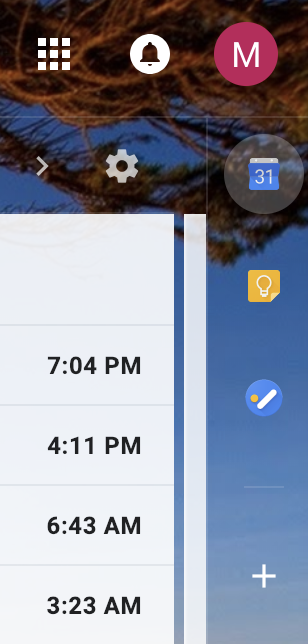
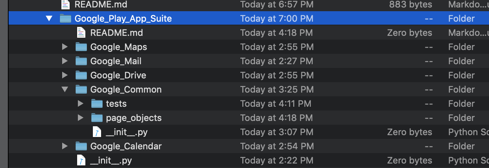

## Setting up tests to handle all Google apps

### Step 1 - Set up a parent directory called Google_Play_App_Suite.  
The package name starts from Google_Play_App_Suite. 

- Google_Play_App_Suite

### Step 2 - Set up a common directory called Google_Common and store common test functions. 
The common code to share among Google app suite goes here.  Example, login, app switcher, etc.  

- Google_Play_App_Suite/Google_Common

### Step 3 - Set up app specific directories and store app specific functions. 

- Google_Play_App_Suite/Google_Mail
- Google_Play_App_Suite/Google_Drive
- Google_Play_App_Suite/Google_Maps
- Google_Play_App_Suite/Google_Calendar

### Step 4 - Import the common test code from the app specific directories.

```
from Google_Play_App_Suite.Google_Common.screens import loginScreen
from Google_Play_App_Suite.Google_Common.screens import SignUpScreen

```
